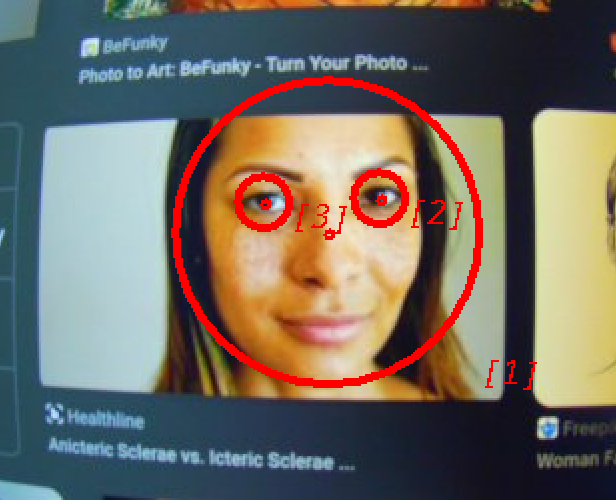

# kimaris

[kimaris](https://en.wikipedia.org/wiki/Kimaris) is a Java implementation of Pixel Intensity Comparison-based Object detection.

Reference code is ported from [pico](https://github.com/nenadmarkus/pico).

## Installation

Available in [Maven Central](https://mvnrepository.com/artifact/io.vacco.kimaris/kimaris).

```
implementation("io.vacco.kimaris:kimaris:<LATEST_VERSION>")
```

This library is able to evaluate cascades in real time, as well as training custom cascades with training datasets
which you must provide. The code contains utility code to load [COCO](https://cocodataset.org) datasets as input
for training.




See test cases for example usage.

- [Cascade training](./src/test/java/KmGenTest.java)
- [Object detection](./src/test/java/KmDetTest.java)

## Notes

Depending on your dataset size, you'll need at least 8GB of available system memory
to load image data during cascade training. 

During training, scale factor must always be greater than 1.0. Otherwise, training will never end.

To convert video data:

```
ffmpeg -i my_video-1.mkv -t 10 \
  -crf 11 -filter:v scale=512:-1 \
  -sws_flags lanczos+accurate_rnd \
~/code/kimaris/src/test/resources/seq-00.mp4
```

Training image data for the `picolrn` binary is serialized as:

```
imageHeight, imgWidth, grayPixelRows, boundsCount, bounds0 ... boundsN
```

`bounds` are `(r, c, s)` tuples.

- `r` - Row   - translates to an image's `Y` coordinate from top-left `(0,0)`.
- `c` - Col   - translates to an image's `X` coordinate from top-left `(0,0)`.
- `s` - Scale - is the diameter of a circle centered at `(c,r)` (I *think*).

The reference code uses these values to represent circles of `(c,r)` origin, and `s / 2` radius.

I have the slight suspicion that this constraints training data to have a `1:1` square
aspect ratio, and generating detectors for rectangular objects like, for example, credit cards
or license plates may present additional issues.

## Citation

> N. Markus, M. Frljak, I. S. Pandzic, J. Ahlberg and R. Forchheimer, "Object Detection with Pixel Intensity Comparisons Organized in Decision Trees", <http://arxiv.org/abs/1305.4537>
